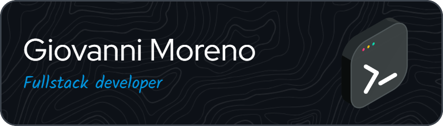

<!-- ====================================================================== -->
<!-- Giovanni Moreno — GitHub Profile README                                -->
<!-- Software Engineer @ IBM | AI/ML & Full-Stack Web Developer | Bogotá, CO -->
<!-- ====================================================================== -->

 

###

  <h1>Hi, I'm Giovanni Moreno 👋</h1>
  <h3>Software Engineer @ IBM · AI/ML & Full-Stack Web Developer · Bogotá, Colombia</h3>

###

## About Me

I'm a Software Engineer at **IBM**, based in Bogotá, Colombia. I build
**AI/ML-powered applications** and **full-stack web products**, with a strong
interest in large language models (LLMs), generative AI, and clean, scalable
backend architectures.

- 🔭 Currently working at **IBM** on enterprise software and AI solutions.
- 🌱 Deepening my expertise in **machine learning, LLMs, and cloud-native development**.
- ⚡ I enjoy turning ideas into shipped products — from data and models to polished UIs.
- 🌐 Portfolio: **[giovanni-moreno.com](https://giovanni-moreno.com)**
- ✍️ Blog: **[blog.giovanni-moreno.com](https://blog.giovanni-moreno.com)**
- 📫 Reach me at **ingestebanmu@gmail.com**

###

## 🚀 Featured Projects

###

## 🛠️ Tech Stack

  
  
  
  
  
  
  
  
  
  
  
  
  
  
  
  
  
  
  
  
  
  
  
  
  
  
  

###

## 📊 GitHub Stats

  
  

###

## 🤝 Connect with Me

  
  
  
  
  
  

###

 

###
